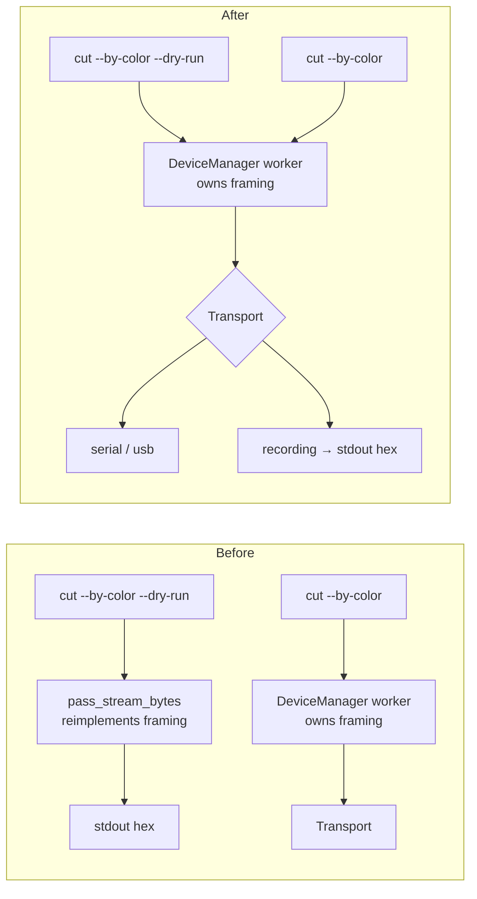

<!-- SPDX-License-Identifier: GPL-3.0-or-later -->

# Architecture review — 2026-07-27

Deepening opportunities: refactors that turn a shallow module into a deep one, judged for testability
and for how much a reader has to hold in their head at once.

Scoped to the hot spots of the last 60 commits rather than the whole tree, because deepening a module
pays off through the changes that come after it: `crates/cli/src/pipeline.rs` (10 touches),
`crates/cli/src/main.rs` (9), `crates/cli/src/cut.rs` (8), `crates/driver-core/src/manager.rs` (7),
`apps/desktop/src/device.rs` (6).

Line numbers verified at `c441f83`. `docs/adr/` does not exist yet, so nothing here contradicts a
recorded decision.

## The shape of the problem

Five of the seven candidates are the same defect wearing different clothes: **a module knows a rule,
but its callers restate it.** The cut path has a chokepoint — `cutplan::plan_cut` — and it works.
Trace, session framing, and machine identity never got one, and each has grown two to four
independent statements of the same fact.

| Fact | Owner | Restated in | Copies |
| --- | --- | --- | --- |
| Trace option ranges | `trace::validate` | `main.rs` clap help · `trace/viewmodel.ts` · `TraceDialog` sliders | 3 |
| Trace defaults | `TraceOptions::default` | clap `default_value_t` · `defaultControls` | 3 |
| 256 MiB input cap + capped read | — nobody — | `cli/main.rs` · `desktop/ipc.rs` | 2 |
| Session framing (begin/park/end) | `DeviceManager` worker | `pipeline.rs::pass_stream_bytes` | 2 |
| Machine ids `cameo5`/`puma` | `driver-registry` | CLI `Device` enum (3 sites) · `CutDialog` CAPS | 4 |
| `MachineCaps` per machine | driver encoders | `CutDialog.tsx:20-24` | 2 |
| `CutError` → operator message | — nobody — | `pipeline.rs:160` · `device.rs:198` | 2 |
| `status_of`'s phase/actions table | `driver-core/status.rs` | `e2e/smoke.spec.ts:153-187` | 2 |

The cost is already visible to an operator. Same failure, opposite advice, both correct in their own
frame:

- `crates/cli/src/main.rs:192` — `nothing traced — lower --speckle or lower --detail`
- `apps/desktop/ui/src/trace/TraceDialog.tsx:124` — `Nothing traced — lower speckle filter or raise detail`

`--detail` is `length_threshold` verbatim; the dialog's *Detail* is `13.5 - length_threshold`
(`trace/viewmodel.ts:16`). Same word, same 3.5–10 range, inverted meaning.

---

## Candidate 1 — Trace's interface speaks vtracer, so every caller has to translate

**Strength: strong.**

**Files.** `crates/trace/src/lib.rs:4,18-30,33-43,56-70` · `crates/cli/src/main.rs:10-44,100-113,177-197` ·
`apps/desktop/src/ipc.rs:169-273` · `apps/desktop/ui/src/trace/viewmodel.ts:3-17,37` ·
`apps/desktop/ui/src/trace/TraceDialog.tsx:124,132,146-149`

**Problem.** `trace` is a genuinely deep module — six exported names over ~310 lines that handle a
decompression bomb, a visioncortex panic, transparency compositing, and a transparent-row padding
hack. But its *interface* is vtracer's parameter list with `pub` fields, so the module's knowledge
leaks and each caller restates it:

- Four ranges stated three times: `trace::validate` (`lib.rs:56-70`), clap help
  (`main.rs:102-113`), TS type comments plus slider bounds (`viewmodel.ts:5-8`,
  `TraceDialog.tsx:146-149`). Twelve numbers that must agree.
- Defaults stated three times: `TraceOptions::default()` (`lib.rs:25-30`), clap `default_value_t`
  (`main.rs:100-113`), `defaultControls` (`viewmodel.ts:11`).
- Clap does not enforce the ranges — `speckle: u8` accepts 0–255 and the refusal comes back from
  `validate` at run time.
- `MAX_DIM` is public but no Rust caller imports it; the UI hardcodes `2048` in a user-facing string
  (`TraceDialog.tsx:132`), and the CLI never surfaces `downscaled` at all.
- `TraceError::EmptyResult` renders as the literal `"empty"` (`lib.rs:40`), and TypeScript matches
  that string (`viewmodel.ts:37`). One consumer is type-checked, the other is matched against a
  `Display` impl.
- The 256 MiB input cap and the capped-read routine are implemented twice —
  `main.rs:10-44` and `ipc.rs:169-273` — down to the error text and the argument in the comments.
  Neither copy belongs to either binary: it exists to bound `trace`'s decoder.

**Solution.** Move the whole input contract behind the seam. `trace` exports a `TraceControls` type
in user-facing units (detail rises with detail), a table of control specs (name, range, default,
step) that both callers read instead of restating, a typed empty outcome rather than a `Display`
string, and a `trace::read_image(path)` that owns the input ceiling next to `MAX_DECODE_ALLOC`.
The vtracer vocabulary stops at the module boundary.

**Benefits.** *Locality*: twelve numbers in three languages collapse into one table beside the other
ceiling this module already owns. *Leverage*: changing a range becomes one edit instead of four plus
a user-visible inversion nobody can see from either side alone. *Tests*: ranges become data a test
can assert; today the UI's copy is checked only by `viewmodel.test.ts:14` asserting the magic `13.5`,
and clap's copy is checked by nothing.

---

## Candidate 2 — `--dry-run` re-derives the session framing it claims to preview

**Strength: strong.**

**Files.** `crates/cli/src/pipeline.rs:27-40` · `crates/cli/src/main.rs:161,223` ·
`crates/driver-core/src/manager.rs` · `crates/driver-core/src/lib.rs:80`

**Problem.** `pass_stream_bytes` reproduces a rule owned by `driver-core`'s worker — `session_begin`
before the first pass, `pass_park` between, `session_end` after the last. Its doc comment is the
contract: *"framed exactly as `DeviceManager` transmits them … keeps `cut --by-color --dry-run`
output faithful."* Nothing fails if the worker's framing changes; the dry run starts lying, and the
two tests in `dry_run.rs` keep passing because they assert against the copy.

Deletion test: removing `pass_stream_bytes` concentrates framing in the one place that already
implements it.

**Solution.** Make `--dry-run` a `Transport` rather than a bypass. The seam already exists and is
real, not hypothetical — `Transport` has three implementations (serial, USB, `MockTransport`), and
`MockTransport` already records writes.

**Benefits.** *Locality*: framing stops having two homes, and the comment promising fidelity becomes
unnecessary because fidelity is structural. *Leverage*: a fourth `Transport` is roughly twenty lines.
*Tests*: `dry_run.rs` starts exercising the real worker loop instead of the copy — the same upgrade
`plain_cut.rs` got when the cut loop grew its factory seam.

---

## Candidate 3 — The CLI carries a second device registry

**Strength: strong.**

**Files.** `crates/cli/src/pipeline.rs:6-25` · `crates/cli/src/main.rs:171,242` ·
`crates/driver-registry/src/lib.rs:15-16` · `apps/desktop/src/device.rs:70-72`

**Problem.** `CLAUDE.md` says `driver-registry` is the single place mapping real hardware to
drivers and transports, and a registry test pins the ids against each driver's own
`MachineProfile::id` so three copies cannot drift. The CLI holds a fourth copy the test does not know
about: `enum Device { Cameo5, Puma }` with its own string literals, a hand-maintained
`[Device::Cameo5, Device::Puma]` for `list-devices` (`main.rs:171`), and a bare `"cameo5"` in
`resolve_device_info` (`main.rs:242`). The desktop calls `factory.list_devices()` instead.

Adding a third machine means editing the CLI in three places that no test covers — `main.rs` has zero
`#[cfg(test)]`.

**Solution.** Delete `Device` and carry the machine id as a string resolved through
`HardwareBackendFactory`, as the desktop does. The `unknown device '{x}' (try: cameo5, puma)` message
gets generated from the registry rather than typed by hand.

**Benefits.** *Leverage*: one place to add a machine instead of four. *Tests*: the existing registry
test extends to cover the CLI, which currently has none. Roughly 25 lines deleted.

---

## Candidate 4 — `MachineCaps` is declared by the Driver and re-declared in TypeScript

**Strength: strong.**

**Files.** `apps/desktop/ui/src/cut/CutDialog.tsx:16-24` · `apps/desktop/ui/src/cut/viewmodel.ts:116-122` ·
`crates/driver-silhouette/src/encode.rs:17-19` · `crates/driver-hpgl/src/encode.rs:18-20` ·
`crates/cutplan/src/preflight.rs:100-112`

**Problem.** `CONTEXT.md` defines **MachineCaps** as what a machine can be told to do, and each
**Driver** declares its own. The dialog holds a keyed literal table of the same three booleans, so
`fieldDisabled` greys the Puma's speed and force from the TypeScript copy while `preflight`
range-checks them from the Rust one. They agree today because someone typed them to agree. The
existing `ponytail:` comment at `CutDialog.tsx:16-19` already names this as the follow-up.

**Solution.** Carry `MachineCaps` in the `DeviceInfo` payload the UI already receives. The type
exists, already serializes, and the dialog stops knowing machine names.

**Benefits.** *Leverage*: a new machine needs no UI edit. *Locality*: capability lives with the
driver that implements it. Smallest of the strong candidates, and it proves the IPC shape the other
work will want.

---

## Candidate 5 — The CLI cut loop re-derives permissions from `Phase`

**Strength: worth exploring.**

**Files.** `crates/cli/src/cut.rs:115,136-180` · `crates/driver-core/src/status.rs:5-8,43-54` ·
`apps/desktop/ui/src/cut/CutDialog.tsx:335-355`

**Problem.** `grep actions crates/cli/src/cut.rs` returns nothing. The loop matches on
`Phase::AwaitingColorSwap` → `resume()` and `Phase::AwaitingConfirmation` → `confirm_pass_done()`,
then swallows `DeviceError::Busy` in `answer_pause` because the state may have moved between the read
and the answer. That swallow is the tell: it is the race `actions` was introduced to remove.
`status.rs:5-8` says the field exists *"so a caller renders controls from that rather than mapping
phases back to permissions"*; the dialog does exactly that and uses `phase` only for labels.

Secondary: `let total = plan.passes.len()` (`cut.rs:115`) while `status.pass` already carries
`PassPosition { index, total }`. One prompt string prints an index from the status and a denominator
from a local.

**Solution.** Drive the loop from `status.actions` and take both halves of the pass position from
`status.pass`.

**Benefits.** *Leverage*: adding a phase stops meaning "audit every consumer for whether it should
now be answerable". *Tests*: `status.rs`'s five tests already cover the action table, so the CLI
inherits that coverage instead of needing its own. The loop is about 45 lines — small enough to fold
into whichever candidate touches `cut.rs` first.

---

## Candidate 6 — Both entry points assemble their own plan and describe `CutError` twice

**Strength: worth exploring.**

**Files.** `crates/cli/src/pipeline.rs:107-133,137-155,160-173` ·
`apps/desktop/src/device.rs:129-176,198-220` · `crates/cutplan/src/plan.rs:77-116`

**Problem.** The chokepoint holds — both paths reach `plan_cut`. What they duplicate is the
approach: build `Vec<PassSelection>`, build `PlanOptions`, call `plan_passes` then `plan_cut`,
translate the error. The translation is where they diverge substantively: `device.rs` maps seven
preflight variants to IPC codes, while `pipeline.rs` collapses four of them into
`format!("preflight: {e:?}")`, so a CLI user hits `Debug` output for `MachineMismatch` and
`OutputTooLarge`.

**Caution on the deletion test.** The two callers legitimately differ — the desktop always passes
`expect_revision: Some(_)` and hardcodes `allow_out_of_bounds: false`; the CLI passes `None` and
exposes a flag. Merging the assembly risks a shallow wrapper that only re-splays its arguments.

**Solution.** Move the part that clearly wants to move: an operator-facing `Display` on `CutError`
and `PreflightError` in `cutplan`, which both callers wrap rather than reimplement. Leave the plan
assembly alone until there is a third caller.

**Benefits.** *Locality*: every refusal says what the operator did wrong, once, next to the rule that
refused. The CLI stops leaking `Debug` formatting for four preflight failures.

---

## Candidate 7 — The e2e fake is large because the IPC interface is wide

**Strength: speculative.**

**Files.** `apps/desktop/ui/e2e/smoke.spec.ts:153-187,206-230,325-341` ·
`crates/driver-core/src/status.rs:104-142` · `crates/cutplan/src/passes.rs:72` ·
`apps/desktop/src/device.rs:129-134,161-164`

**Problem.** The smoke test's in-page backend transcribes three Rust behaviours into TypeScript —
`status_of`'s phase/actions table, `plan_passes`' colour grouping including the
`stroke & 0xFF != 0` rule, and `prepare_cut`'s validation order. Its own comments say so. It also
diverges on `doc_revision`: a monotonic counter where Rust hashes the snapshot, so an undo back to a
previous document matches in Rust and differs in the fake.

The interface is the test surface, and a fake this big is the honest cost of roughly thirty flat
`#[tauri::command]`s.

**Not worth acting on yet.** An e2e fake that simulates the backend is a legitimate choice, and the
alternative — driving the real binary — trades this cost for a slower, flakier one. Revisit if the
fake starts producing false greens.

---

## Top recommendation

**Candidate 1 — give `trace` its own input contract.**

It is the only candidate where the leak has already reached the user: the CLI and the dialog print
opposite advice for the same failure, and both are right. That is not a refactor smell; it is a bug
with an architectural cause. `TraceOptions` hands vtracer's units to two callers and lets each pick a
translation.

It also has the highest count — twelve range numbers, five defaults, one magic `13.5`, one hardcoded
`2048`, one `Display`-string sentinel, and a 256 MiB file cap implemented twice with matching
comments. Every one collapses into a module that is already deep and already the right owner.

Suggested order:

1. **Candidate 4** (`MachineCaps` over IPC) — an hour's work, already flagged in-repo as the
   follow-up. Proves the IPC shape.
2. **Candidate 1** (trace contract) — the real work, and it fixes the inverted `detail`.
3. **Candidate 2** (dry-run as a `Transport`) — independent of both, deletes code rather than adding
   it.

Candidate 5 folds into whichever of these touches `cut.rs` first. Candidate 6 wants a decision before
code — see its caution note.
